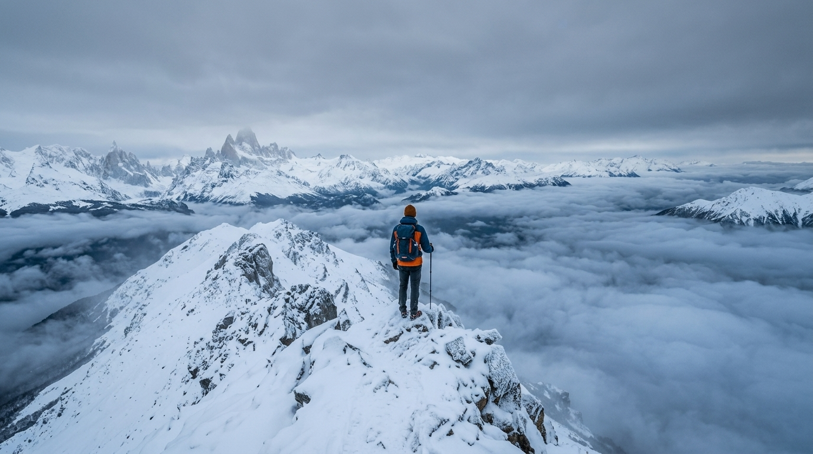

# flowgen — Google Flow 生成 CLI（CDP 直连）


> 🔥 直接调用 **Google Flow（Nano Banana / Veo）** 生成图片和视频的命令行工具。
> 无需 flow-agent、无需浏览器扩展、无需 MCP——只用一条命令。
> 图片生成**完全免费**，视频消耗 Google Flow 每日发放的**免费 credits**。

---

## ✨ 功能

| 命令 | 说明 |
|---|---|
| `flowgen image "提示词"` | **文生图**（Nano Banana，免费） |
| `flowgen image "提示词" --ref a.jpg` | **图生图**（参考图风格迁移） |
| `flowgen video "提示词"` | **文生视频**（Veo 3） |
| `flowgen video "提示词" --start a.jpg` | **图生视频**（起始帧 + 运动） |
| `flowgen credits` | 查当前账号剩余 credits |
| `flowgen projects` | 列出当前账号所有 Flow 项目 |

**特性**：
- 🎨 图片模型：`lite`（Harbor Seal）/ `standard`（Narwhal）/ `pro`（Gemini Pix 2）
- 🎬 视频时长：4 / 6 / 8 / 10 秒
- 📐 比例：landscape / portrait / square / 4x3 / 3x4
- 🔄 **多账号支持**：换 Google 账号 = 换额度，自动探测项目 ID
- 🧩 零依赖服务：只连你已登录的 Chrome，不需要任何后台服务

---

## 📦 安装

### 前置条件

1. **Python 3.10+** 和 [uv](https://docs.astral.sh/uv/)（或任意 venv 工具）
2. **Chrome**（已登录 Google 账号，需能访问 [labs.google/fx/tools/flow](https://labs.google/fx/tools/flow)）
3. **代理**：如果你在中国大陆，需让 Google 走代理（示例默认 `http://127.0.0.1:1082`）

### 步骤

```bash
# 1. 克隆仓库
git clone https://github.com/xujie8867/flowgen.git
cd flowgen

# 2. 安装依赖（只需 websockets）
uv venv --python 3.11 .venv
uv pip install --python .venv/bin/python websockets

# 3. 安装命令
ln -sf "$PWD/flowgen.py" ~/.local/bin/flowgen

# 4. 启动 Chrome（CDP 调试端口）
"/Applications/Google Chrome.app/Contents/MacOS/Google Chrome" \
  --remote-debugging-port=9224 \
  --user-data-dir="$HOME/flowgen-chrome-profile" \
  --no-first-run \
  --proxy-server=http://127.0.0.1:1082 \
  https://labs.google/fx/tools/flow
```

> ⚠️ **必须**：Chrome 保持打开，且页面停留在 `labs.google/fx/tools/flow`（首次访问会自动创建 Flow 项目）。

### 配置（可选环境变量）

| 变量 | 默认值 | 说明 |
|---|---|---|
| `FLOW_CDP_PORT` | `9224` | Chrome 调试端口 |
| `FLOW_PROJECT_ID` | 自动探测 | 指定 Flow 项目 ID |
| `FLOW_PROXY` | `http://127.0.0.1:1082` | Google 代理 |

---

## 🚀 使用

```bash
# 查 credits
flowgen credits

# 列项目
flowgen projects

# 文生图
flowgen image "A lone hiker on a misty mountain ridge at sunrise, cinematic, photorealistic" -o sunset_hike.jpg

# 图生图（参考图 + 转换）
flowgen image "Turn this into a winter snow version, same composition" -o winter.jpg --ref sunset_hike.jpg

# 图生视频（起始帧动画化）
flowgen video "Camera slowly dolly forward, mist rolling over the ridge" --start sunset_hike.jpg -o hike.mp4

# 文生视频
flowgen video "A giant whale swimming through clouds above a neon cyberpunk city at night" -o whale.mp4

# 指定项目（多账号切换）
flowgen --project 01c43094-xxxx-xxxx-xxxx-xxxxxxxxxxxx video "..." -o out.mp4
```

---

## 🖼️ 示例

### 文生图（landscape）

*"A lone hiker standing on a misty mountain ridge at golden sunrise, dramatic clouds below, cinematic wide shot, photorealistic"*

### 文生图（portrait，中文 prompt）

*"一位穿着红色汉服的少女站在江南水乡石桥上，油纸伞，细雨朦胧，写实摄影风格"*

### 图生图（参考图转换）

*基于上图转换成雪景版本，构图保持*

### 图生视频（起始帧动画化）
[▶ 雪山徒步者视频（8s）](examples/example_video_dolly.mp4)
*"Camera slowly dolly forward, mist rolling over the mountain ridge, the hiker stands still gazing at the sunrise"*

### 文生视频
[▶ 赛博鲸鱼视频（8s）](examples/example_video_whale.mp4)
*"A giant whale swimming through the clouds above a neon-lit cyberpunk city at night, cinematic camera orbit"*

---

## 💡 使用心得（作者实测经验）

### 1. 稳定性实测（2026-08-15 压测 11 项全过）
- credits / projects / image / video / 图生图 / 图生视频 / 文生视频 全部稳定
- 视频生成约 **40 秒**，全流程（上传+生成+下载）约 **1 分钟**
- 视频规格：1280×720，h264 + aac，8 秒约 2MB

### 2. 多账号 = 多额度
- Google Flow 每日发免费 credits 到账号，**换账号 = 换额度**
- 同一 Chrome 右上角切账号 → `flowgen projects` 自动列出新账号项目 → 指定 `--project` 即可
- 作者有 3 个 Google 账号轮换使用

### 3. 常见坑
| 坑 | 解决 |
|---|---|
| Chrome 打不开 CDP | 必须先 `--remote-debugging-port=9224` 启动 |
| `Failed to fetch` | 页面必须停留在 `labs.google/fx/tools/flow`（reCAPTCHA 需要页面上下文） |
| credits 为 0 | 账号被限制或未领取每日额度，换账号试试 |
| 下载失败 | 检查代理是否可用（curl -x 127.0.0.1:1082 https://www.google.com 验证） |
| websockets 报 proxy 错误 | CLI 已自动清除代理环境变量，无需手动处理 |

### 4. 为什么不用 flow-agent / 扩展？
- flow-agent 是现成方案但依赖 Chrome 扩展（Chrome 151+ 命令行禁加载扩展）且有 Python 3.14 兼容 bug
- 本工具**直接 CDP 连 Chrome 页面**，页面自带 reCAPTCHA 处理，零中间件
- 自己写 bridge 模拟扩展协议也试过——不如直接页面内 fetch 简单可靠

---

## 📁 项目结构

```
flowgen/
├── flowgen.py          # 主 CLI（单文件，~500 行）
├── examples/           # 示例图片 + 视频
└── README.md
```

## ⚖️ 许可

MIT License — 仅供学习参考。请遵守 Google Flow 服务条款，勿滥用免费额度。

## 📌 维护说明

- 项目活跃维护中，最新变更见 [CHANGELOG.md](CHANGELOG.md)
- 遇到问题欢迎开 Issue
